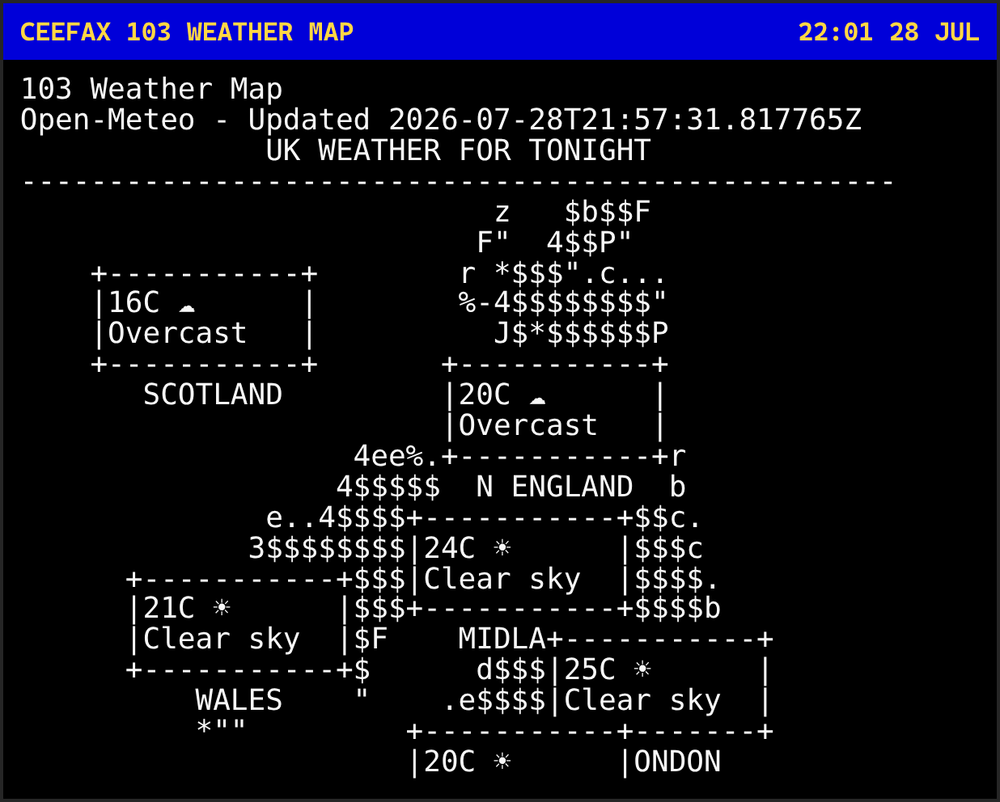
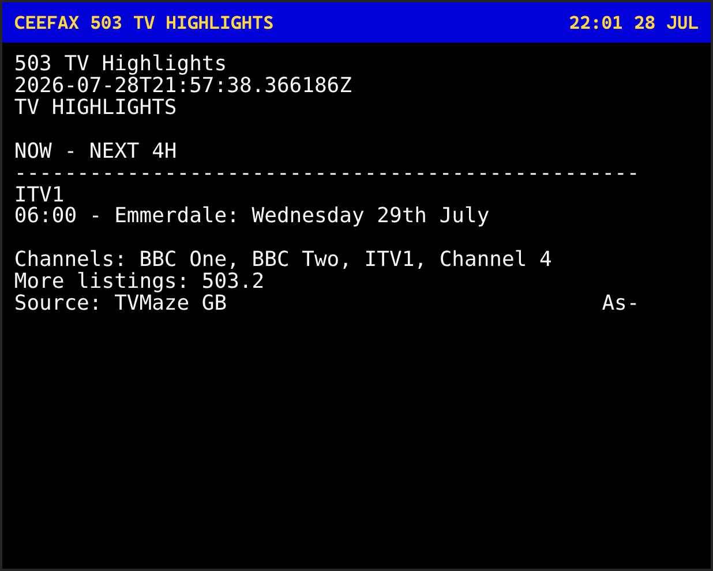
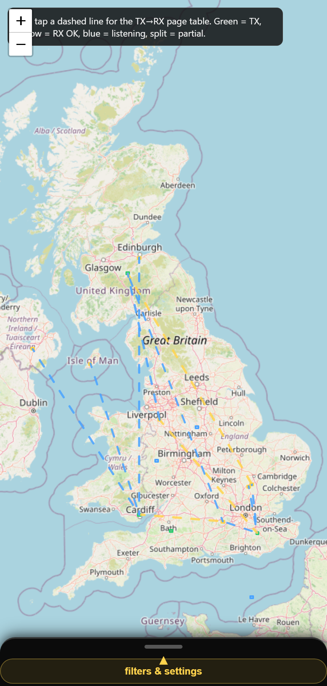
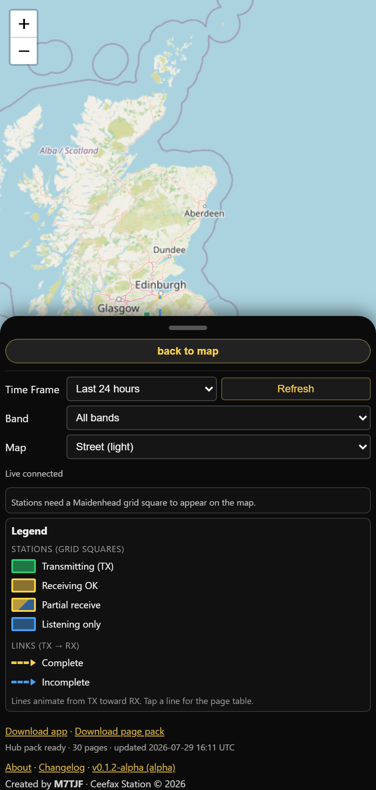

<p align="center">
  
</p>

# Ceefax Station

<p align="center">
  <a href="https://www.python.org/"></a>
  <a href="LICENSE"></a>
  
  
  <br/>
  
  
  
  <a href="https://fastapi.tiangolo.com/"></a>
  <a href="https://leafletjs.com/"></a>
  <a href="https://docs.pytest.org/"></a>
</p>

A modern recreation of the classic Ceefax teletext service for Windows amateur radio stations: live data pages, AX.25 packet radio TX/RX, a responsive terminal viewer, and a public web tracker.

## Features

### Teletext Pages
- **Weather** — UK forecasts, local weather, UK weather map (Open-Meteo)
- **News** — Headlines, UK, and world news (Guardian API with BBC RSS fallback)
- **Sport** — Headlines, live scores, league tables, fixtures (football-data.org + BBC RSS)
- **Entertainment** — TV highlights (TVMaze), film picks (TMDB), facts, quotes, jokes, quiz
- **Finance / travel** — Exchange rates, lottery results, TfL travel info
- **Radio** — Callsign / PSK Reporter activity on page 700

Live pages use durable providers with **last-known-good caching**. If a feed is down, Ceefax keeps showing the last good page and marks it stale instead of blanking out.

### Packet Radio (AX.25)
- Transmit pages via AFSK1200
- Receive and decode AX.25 packets (Dire Wolf)
- Hourly automatic TX with page refresh **before** the hour, then play on `:00`
- In-terminal TX / RX dashboards

### Terminal Viewer
- Authentic Ceefax-style layout
- Works in standard **80×24** PowerShell windows and larger terminals
- Three-digit page entry, unified Esc behaviour, TX/RX modes from the TUI

### Web Tracker
- Public map of transmitting and receiving stations
- Maidenhead grid squares and station-to-station links
- Live at [ceefaxstation.com](https://ceefaxstation.com)

## Screenshots

### Terminal viewer

<table>
  <tr>
    <td align="center">
      <a href="screenshots/ceefax-terminal/page-000.png">
        
      </a>
      <br/><sub><b>Page 000</b> — Start</sub>
    </td>
    <td align="center">
      <a href="screenshots/ceefax-terminal/page-101.png">
        
      </a>
      <br/><sub><b>Page 101</b> — Weather</sub>
    </td>
    <td align="center">
      <a href="screenshots/ceefax-terminal/page-103.png">
        
      </a>
      <br/><sub><b>Page 103</b> — UK weather map</sub>
    </td>
  </tr>
  <tr>
    <td align="center">
      <a href="screenshots/ceefax-terminal/page-200.png">
        
      </a>
      <br/><sub><b>Page 200</b> — News</sub>
    </td>
    <td align="center">
      <a href="screenshots/ceefax-terminal/page-304.png">
        
      </a>
      <br/><sub><b>Page 304</b> — Fixtures</sub>
    </td>
    <td align="center">
      <a href="screenshots/ceefax-terminal/page-402.png">
        
      </a>
      <br/><sub><b>Page 402</b> — Lottery</sub>
    </td>
  </tr>
  <tr>
    <td align="center">
      <a href="screenshots/ceefax-terminal/page-503.png">
        
      </a>
      <br/><sub><b>Page 503</b> — TV highlights</sub>
    </td>
    <td align="center">
      <a href="screenshots/ceefax-terminal/page-504.png">
        
      </a>
      <br/><sub><b>Page 504</b> — Film picks</sub>
    </td>
    <td></td>
  </tr>
</table>

### Web tracker


| Mobile map | Mobile panel |
| --- | --- |
|  |  |

## Quick Start

### Prerequisites
- **Python 3.11** (required for special-character support)
- **Windows** (primary supported platform)
- Optional: Dire Wolf for live RX decode

### Installation

#### Option 1: Windows Installer

1. Download the latest installer from `installers/` (for example `CeefaxStation-Setup-0.1.0.exe`)
2. Run the setup wizard
3. Configure callsign / frequency / grid via Start Menu → **Configure Station**, or edit `ceefax/radio_config.json`

The packaged installer can lag behind GitHub `main`. For the newest code, use Option 2.

#### Option 2: From Git

```bash
git clone https://github.com/thaum-labs/ceefax_station.git
cd ceefax_station
python -m pip install -r ceefax/requirements.txt
```

On Windows, also install curses support:

```bash
python -m pip install windows-curses
```

Edit `ceefax/radio_config.json`:

```json
{
  "callsign": "YOUR_CALLSIGN",
  "frequency": "2m (144.0-148.0 MHz)",
  "grid": "IO91WM"
}
```

### Optional API keys

Most pages work without keys. These unlock richer / required live sources:

| Variable | Pages | Provider | Free? |
|---|---:|---|---|
| `GUARDIAN_API_KEY` | 200–202 | Guardian Open Platform (BBC RSS fallback) | Yes (non-commercial) |
| `FOOTBALL_DATA_API_KEY` | 301–304 | football-data.org | Yes (free tier) |
| `LOTTERY_RESULTS_API_KEY` | 402 | Lottery Results Feed | Yes (100 calls/month) |
| `TMDB_API_KEY` | 504 | The Movie Database | Yes (non-commercial) |
| `CEEFAX_PROVIDER_CACHE` | all | Optional cache directory override | — |

**macOS / Linux** (add to `~/.zshrc` or `~/.bashrc`):

```bash
export GUARDIAN_API_KEY="..."
export FOOTBALL_DATA_API_KEY="..."
export LOTTERY_RESULTS_API_KEY="..."
export TMDB_API_KEY="..."
```

**Windows PowerShell** (permanent for your user; reopen the terminal after):

```powershell
[Environment]::SetEnvironmentVariable("GUARDIAN_API_KEY", "...", "User")
[Environment]::SetEnvironmentVariable("FOOTBALL_DATA_API_KEY", "...", "User")
[Environment]::SetEnvironmentVariable("LOTTERY_RESULTS_API_KEY", "...", "User")
[Environment]::SetEnvironmentVariable("TMDB_API_KEY", "...", "User")
```

Do **not** commit API keys to the repository.

Lottery tip: each live refresh uses **2** API calls. Successful results are reused for 24 hours so the free monthly quota lasts.

## Usage

### Viewer (debug)
```bash
ceefaxstation debug --view
ceefaxstation debug --refresh --view
```

Viewer controls:
- Type a **three-digit** page number (for example `503`)
- `n` / Right / Page Down — next page
- `p` / Left / Page Up — previous page
- `r` — receive mode · `t` — transmit mode
- `F5` — reload pages from disk
- `Esc` / `q` — exit or leave TX/RX

### Receive
```bash
ceefaxstation rx latest
ceefaxstation rx live
```

### Transmit
```bash
ceefaxstation tx now --play
ceefaxstation tx hourly --play
```

Hourly mode refreshes pages shortly before the hour, prepares the WAV, then plays on the hour.

### Upload logs to the web tracker

No token required — uploads go to the public tracker:

```bash
ceefaxstation upload
```

Or:

```powershell
.\start_uploader.ps1
```

## Project Structure

```
.
├── ceefax/                 # Station app, pages, providers, viewer
│   ├── src/                # Updaters, AX.25, terminal UI
│   ├── pages/              # Generated teletext JSON (local / runtime)
│   ├── cache/providers/    # Last-known-good provider cache
│   └── requirements.txt
├── ceefaxstation/          # CLI entrypoint
├── ceefaxweb/              # Public tracker server (central host)
├── screenshots/            # README images
├── scripts/                # Screenshot / logo generators
└── installers/             # Windows setup builds
```

## Regenerating screenshots

From a machine with refreshed `ceefax/pages/*.json` and Playwright installed:

```bash
python -m pip install playwright
python -m playwright install chromium
python scripts/generate_ceefax_viewer_screenshots.py
python scripts/generate_readme_logo.py
python scripts/generate_tracker_screenshots.py
```

## Development

- Versioning: semantic, currently alpha (`VERSION` + `CHANGELOG.json`)
- Tests: `python -m pytest`
- Preferred base branch: `main`

## License

MIT License — see [LICENSE](LICENSE).

Created by M7TJF

## Links

- **Live Tracker**: [ceefaxstation.com](https://ceefaxstation.com)
- **Repository**: [github.com/thaum-labs/ceefax_station](https://github.com/thaum-labs/ceefax_station)

---

**Ceefax Station** — bringing teletext to the modern era with packet radio
