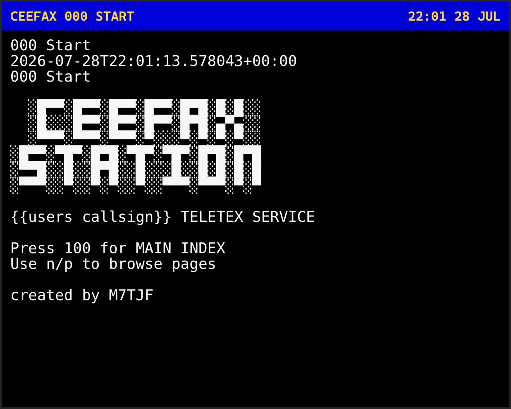
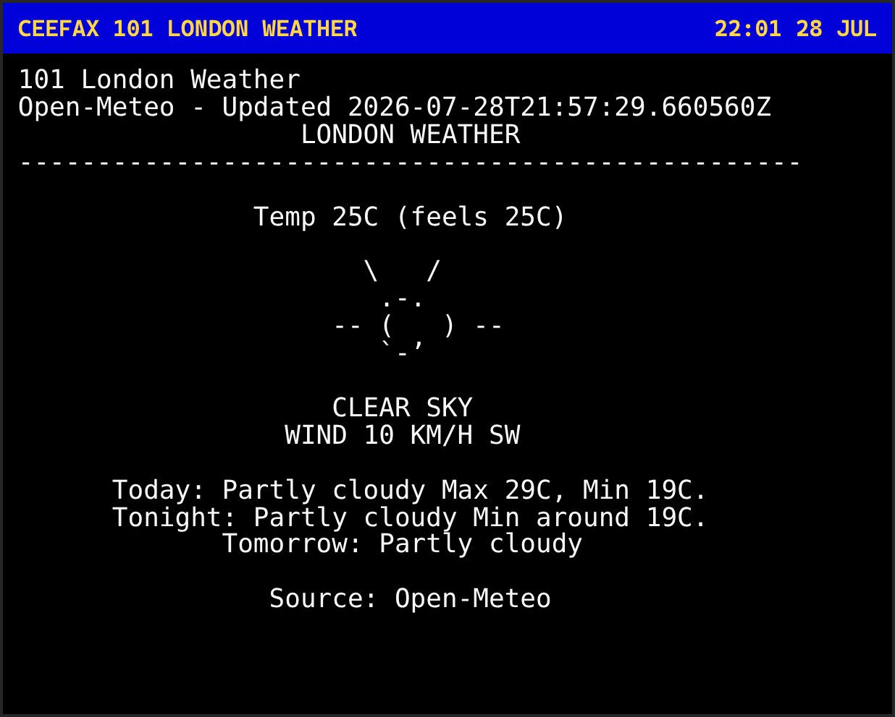
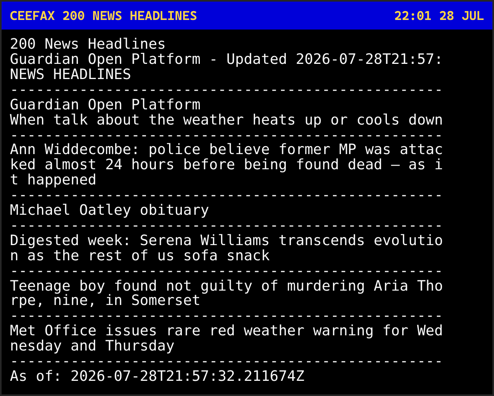
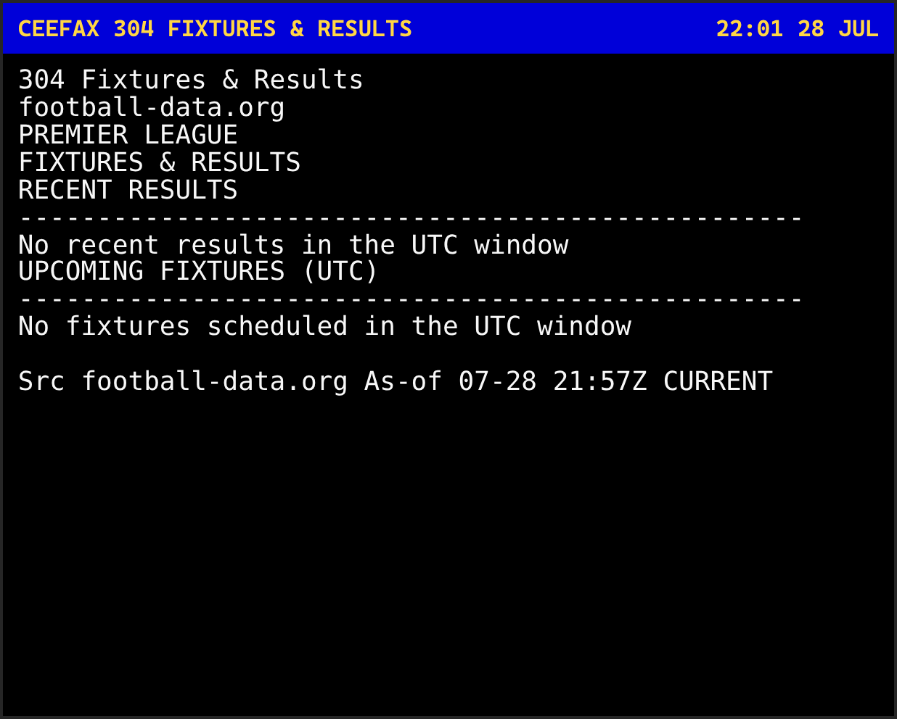
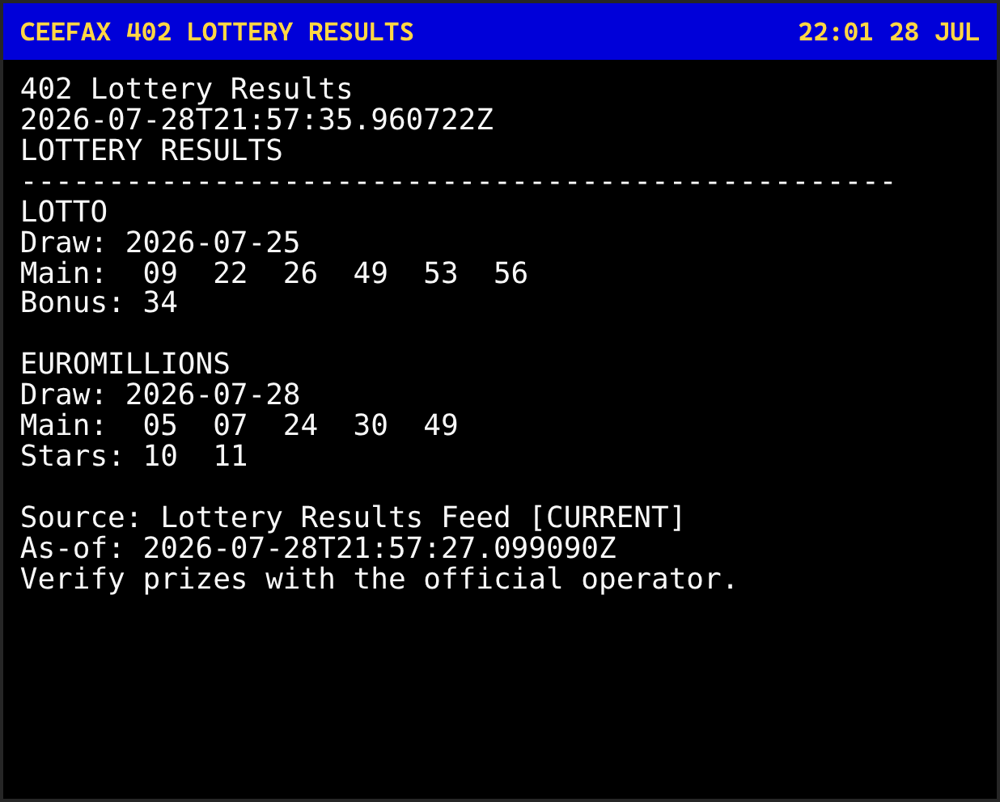
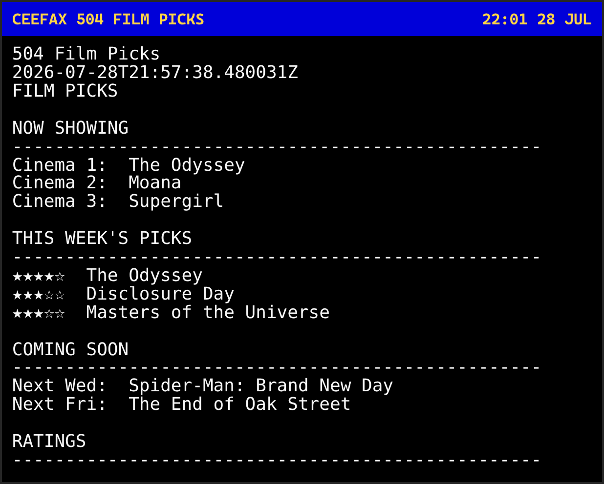
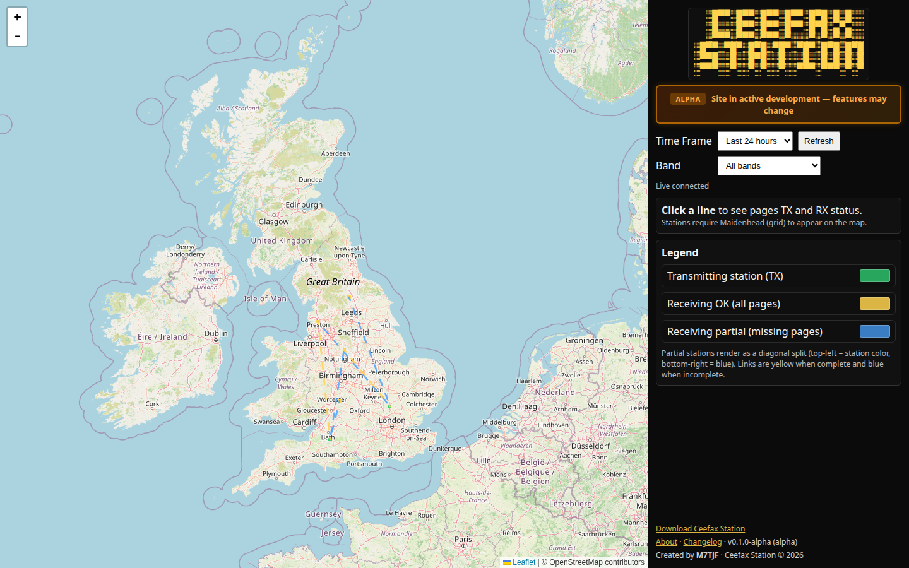

<p align="center">
  
</p>

# Ceefax Station

<p align="center">
  <a href="https://www.python.org/"></a>
  <a href="LICENSE"></a>
  
  
  <br/>
  
  
  
  <a href="https://fastapi.tiangolo.com/"></a>
  <a href="https://leafletjs.com/"></a>
  <a href="https://docs.pytest.org/"></a>
</p>

## What is this?

Old-school **Ceefax** teletext pages — on your PC, and optionally over amateur radio.

With Ceefax Station you can:

1. Browse live-style pages (weather, news, football, TV, lottery, …)
2. Transmit those pages over radio (licensed operators)
3. Receive pages from other stations
4. Appear on the public map: [ceefaxstation.com](https://ceefaxstation.com)

**You do not need API keys.** Stations download a shared page pack from ceefaxstation.com automatically.  
**You do not need a radio** just to try the viewer.

> Alpha software — it works, but things may still change.

---

## Screenshots

<table>
  <tr>
    <td align="center"><br/><sub>Start</sub></td>
    <td align="center"><br/><sub>Weather</sub></td>
    <td align="center"><br/><sub>News</sub></td>
  </tr>
  <tr>
    <td align="center"><br/><sub>Football</sub></td>
    <td align="center"><br/><sub>Lottery</sub></td>
    <td align="center"><br/><sub>Films</sub></td>
  </tr>
</table>



---

## Quick start (recommended)

Best way to get the **latest** version: install from GitHub (the Windows `.exe` installer can be older).

### 1. Install Python 3.11

- Download: [python.org/downloads](https://www.python.org/downloads/)
- On Windows: tick **Add Python to PATH**

### 2. Download Ceefax Station

```bash
git clone https://github.com/thaum-labs/ceefax_station.git
cd ceefax_station
```

No Git? On GitHub click the green **Code → Download ZIP**, then unzip.

### 3. Install packages

```bash
python -m pip install -r ceefax/requirements.txt
```

On Windows also run:

```bash
python -m pip install windows-curses
```

### 4. Set your station name

Edit `ceefax/radio_config.json`:

```json
{
  "callsign": "YOUR_CALLSIGN",
  "frequency": "2m (144.0-148.0 MHz)",
  "grid": "IO91WM"
}
```

- **callsign** — your amateur callsign, or any short name for testing  
- **grid** — Maidenhead locator (e.g. `IO91WM`) so you can appear on the map  
- **frequency** — only needed if you transmit

### 5. Run it

```bash
python -m ceefaxstation debug --refresh --view
```

That will:

1. Download shared pages from [ceefaxstation.com](https://ceefaxstation.com) (no keys needed)
2. Update your local weather / callsign pages
3. Open the Ceefax viewer

---

## Using the viewer

| Key | What it does |
| --- | --- |
| Type `101`, `200`, `304`… | Go to that page |
| `n` or → | Next page |
| `p` or ← | Previous page |
| `F5` | Reload pages from disk |
| `t` | Transmit menu |
| `r` | Receive menu |
| `Esc` or `q` | Back / quit |

Useful pages: **101** weather · **200** news · **304** football · **402** lottery · **503** TV · **504** films

---

## Pages without doing anything fancy

By default, refresh uses the **hub page pack**:

```bash
python -m ceefaxstation pages pull
python -m ceefaxstation debug --refresh --view
```

| What | Where it comes from |
| --- | --- |
| News, sport, lottery, TV, films, UK weather… | Downloaded from ceefaxstation.com |
| Local weather (102) | Updated on your PC |
| Callsign / radio page (700) | Updated on your PC |

If the hub is briefly down, Ceefax falls back to building pages on your PC (some pages then need API keys — usually you can ignore this).

---

## Optional: Windows installer

There is an installer in [`installers/`](installers/) (`CeefaxStation-Setup-0.1.0.exe`).

It is the easiest install, but it **may be behind** the latest GitHub code. Prefer the Quick start above if you want hub page packs and newest features.

---

## Radio (TX / RX)

You need a valid licence, a radio, and audio into the PC. For live receive decode, install [Dire Wolf](https://github.com/wb2osz/direwolf).

```bash
# Transmit once
python -m ceefaxstation tx now --play

# Transmit every hour (refreshes pages first)
python -m ceefaxstation tx hourly --play

# Receive latest WAV / live audio
python -m ceefaxstation rx latest
python -m ceefaxstation rx live
```

### Appear on the map

```bash
python -m ceefaxstation upload
```

Or on Windows: `.\start_uploader.ps1`

Then open [ceefaxstation.com](https://ceefaxstation.com). Make sure your **grid** is set in `radio_config.json`.

---

## Page guide

| Pages | Content |
| --- | --- |
| 101–103 | Weather + UK map |
| 200–202 | News |
| 300–305 | Sport / football |
| 400–402 | Money, travel, lottery |
| 500–504 | Facts, quotes, TV, films |
| 600–602 | Jokes, art, quiz |
| 700 | Radio / callsign activity |
| 900 | About |

---

## Mini glossary

| Word | Meaning |
| --- | --- |
| **Hub / page pack** | Shared pages hosted on ceefaxstation.com so stations don’t need API keys |
| **Callsign** | Your amateur radio ID |
| **Grid** | Short location code for the map (Maidenhead) |
| **TX / RX** | Transmit / receive |
| **AX.25** | Packet radio format used to send pages as audio |

---

## Helpful links

- Live map + hub: [ceefaxstation.com](https://ceefaxstation.com)
- Extra technical notes: [ceefax/README.md](ceefax/README.md)
- Licence: [MIT](LICENSE)

---

## For developers

<details>
<summary>Click to expand</summary>

```
ceefax/           station app, page updaters, viewer
ceefaxstation/    CLI (`python -m ceefaxstation ...`)
ceefaxweb/        official site source (ceefaxstation.com — not for self-hosting)
installers/       Windows setup .exe (may lag main)
```

```bash
python -m pytest
```

</details>

---

Created by **M7TJF**

**Ceefax Station** — old-school teletext, new-school packet radio
